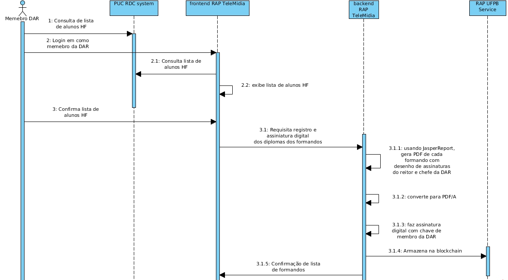
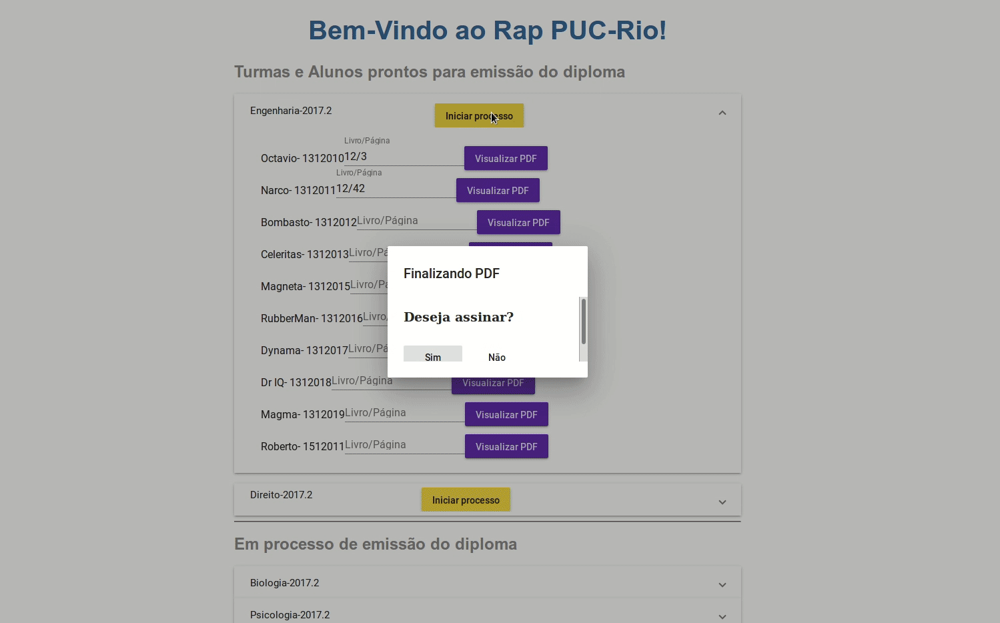

# RAP-pucrio

[GT-RAP](http://wrnp.rnp.br/sites/wrnp2017/files/02_wrnp2017_poster_gt-sap_design.pdf)
stands for Registration, Authentication and Digital Document Preservation.
Funded by RNP, this project aimed at using blockchain technology to create a public
document registration and authentication service. This repository consist on the PUC-Rio
client prototipe. The sequence diagram bellow illustreate the comunication with
RAP UFPB  service.

## Screenshots

